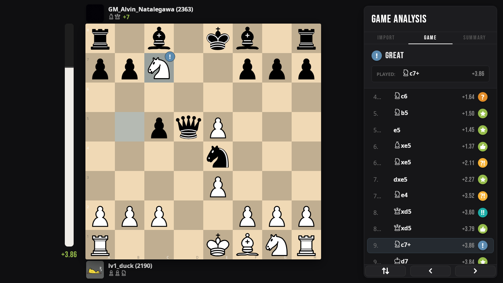
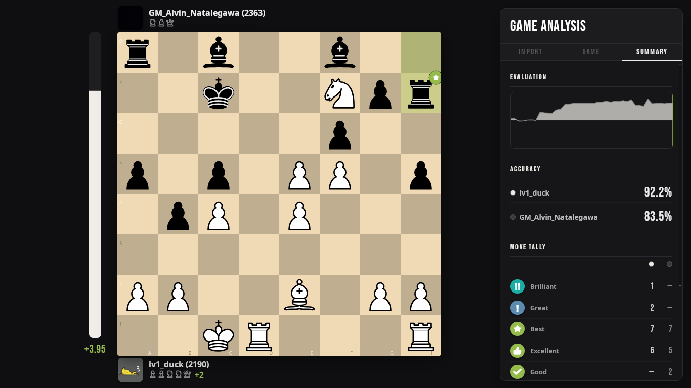

## chess-game-reviewer

Creating a game review tool inspired by chess.com game review, but its free and local in a desktop app

- import games from chess.com and lichess, or just paste a pgn.
- summarizes accuracy scores
- classifies moves (Best, Excellent, Good, Inaccuracy, Mistake, Blunder, Miss, etc.)
- evaluates positions using Stockfish UCI binary that runs natively on the machine.

